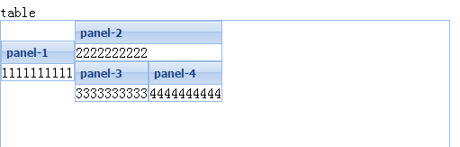

<!-- # Ext.js -->

### Ext.define 创建类

```vue
mixins：融入其他类的方法
    Ext.define('CanSing', {
        sing: function() {
            alert("I'm on the highway to hell...")
        }
    });
    Ext.define('Musician', {
        mixins: {
            canSing: 'CanSing'
        },

        sing: function() {
            // delegate singing operation to mixin
            this.mixins.canSing.sing.call(this);
        }
    })
```
<table>
  <tr>
    <th>语法</th>
    <th>属性</th>
    <th>用法</th>
  </tr>
  <tr>
    <td rowspan="10">
        <i style='color:red'>定义一个类</i>
        <br>
        Ext.define(类名,配置对象{},类创建完后执行该函数)
    </td>
    <td>extend:'要继承的类名'</td>
    <td>继承其他类</td>
  </tr>
  <tr>
    <td>alias:'简写类名'</td>
    <td>定义alias后续可以通过xtype来创建该组件的实例</td>
  </tr>
  <tr>
    <td>requires:需要使用到的类名数组</td>
    <td>需要使用到的类名数组，在动态加载时会根据该属性去下载类，注意需要的类是在当前类之前被加载</td>
  </tr>
  <tr>
    <td>mixins:{命名:要混入的类}/[要混入的类]</td>
    <td>使用数组混入的话，如果当前类和混入的方法重名则不能调用，使用对象类型进行混入则可以用this.mixins.命名.xxx进行使用</td>
  </tr>
  <tr>
    <td>refs:[{ref:'list',selector:'grid'}]</td>
    <td>这将会产生一个this.getList()方法，该方法会通过Ext.ComponentQuery去页面中获取组件为grid的组件</td>
  </tr>
  <tr>
    <td>fields: [{ name: '字段名称', type: '字段类型' }]</td>
    <td>
        <i style='color:red'>配合extend: 'Ext.data.Model'使用</i>
        <br>
        用于设置模型(model)的字段的数据类型
    </td>
  </tr>
  <tr>
    <td>xtype:""</td>
    <td>
        作为Ext组件的简写，用来创建组件
    </td>
  </tr>
  <tr>
    <td>items</td>
    <td>
        用来定义当前组件的子组件
    </td>
  </tr>
  <tr>
    <td>layout</td>
    <td>
        用来定义容器的布局
    </td>
  </tr>
</table>

### xtype与组件类的对应表

<table>
  <tr>
    <td style="color:red" colspan='3'>基本组件：</td>
  </tr>
  <tr>
    <th>xtype</th>
    <th>Class</th>
    <th>描述</th>
  </tr>
  <tr>
    <td>button</td>
    <td>Ext.Button</td>
    <td>按钮</td>
  </tr>
  <tr>
    <td>splitbutton</td>
    <td>Ext.SplitButton</td>
    <td>带下拉菜单的按钮</td>
  </tr>
  <tr>
    <td>cycle</td>
    <td>Ext.CycleButton</td>
    <td>带下拉选项菜单的按钮</td>
  </tr>
  <tr>
    <td>buttongroup</td>
    <td>Ext.ButtonGroup</td>
    <td>编组按钮(Since 3.0)</td>
  </tr>
  <tr>
    <td>slider</td>
    <td>Ext.Slider</td>
    <td>滑动条</td>
  </tr>
  <tr>
    <td>colorpalette</td>
    <td>Ext.ColorPalette</td>
    <td>调色板</td>
  </tr>
  <tr>
    <td>datepicker</td>
    <td>Ext.DatePicker</td>
    <td>日期选择面板</td>
  </tr>
  <tr>
    <td>progress</td>
    <td>Ext.ProgressBar</td>
    <td>进度条</td>
  </tr>
</table>

<table>
  <tr>
    <td style="color:red" colspan='3'>容器及数据类组件：</td>
  </tr>
  <tr>
    <th>xtype</th>
    <th>Class</th>
    <th>描述</th>
  </tr>
  <tr>
    <td>window</td>
    <td>Ext.Window</td>
    <td>窗口</td>
  </tr>
  <tr>
    <td>viewport</td>
    <td>Ext.ViewPort</td>
    <td>视口，即浏览器的视口，能随之伸缩</td>
  </tr>
  <tr>
    <td>box</td>
    <td>Ext.BoxComponent</td>
    <td>盒子组件，相当于一个div</td>
  </tr>
  <tr>
    <td>component</td>
    <td>Ext.Component</td>
    <td>组件</td>
  </tr>
  <tr>
    <td>container</td>
    <td>Ext.Container</td>
    <td>容器</td>
  </tr>
  <tr>
    <td>panel</td>
    <td>Ext.Panel</td>
    <td>面板</td>
  </tr>
  <tr>
    <td>tabpanel</td>
    <td>Ext.TabPanel</td>
    <td>选项面板</td>
  </tr>
  <tr>
    <td>treepanel</td>
    <td>Ext.tree.TreePanel</td>
    <td>树型面板</td>
  </tr>
  <tr>
    <td>flash</td>
    <td>Ext.FlashComponent</td>
    <td>显示 Flash 的组件</td>
  </tr>
  <tr>
    <td>grid</td>
    <td>Ext.grid.GridPanel</td>
    <td>表格</td>
  </tr>
  <tr>
    <td>editorgrid</td>
    <td>Ext.grid.EditorGridPanel</td>
    <td>可编辑的表格</td>
  </tr>
  <tr>
    <td>propertygrid</td>
    <td>Ext.grid.PropertyGrid</td>
    <td>属性表格</td>
  </tr>
  <tr>
    <td>editor</td>
    <td>Ext.Editor</td>
    <td>编辑器</td>
  </tr>
  <tr>
    <td>dataview</td>
    <td>Ext.DataView</td>
    <td>数据显示视图</td>
  </tr>
  <tr>
    <td>listview</td>
    <td>Ext.ListView</td>
    <td>列表视图</td>
  </tr>
</table>

<table>
  <tr>
    <td style="color:red" colspan='3'>工具栏组件：</td>
  </tr>
  <tr>
    <th>xtype</th>
    <th>Class</th>
    <th>描述</th>
  </tr>
  <tr>
    <td>paging</td>
    <td>Ext.PagingToolbar</td>
    <td>分页工具条</td>
  </tr>
  <tr>
    <td>toolbar</td>
    <td>Ext.Toolbar</td>
    <td>工具栏</td>
  </tr>
  <tr>
    <td>tbbutton</td>
    <td>Ext.Toolbar.Button</td>
    <td>工具栏按钮</td>
  </tr>
  <tr>
    <td>tbfill</td>
    <td>Ext.Toolbar.Fill</td>
    <td>工具栏填充区</td>
  </tr>
  <tr>
    <td>tbitem</td>
    <td>Ext.Toolbar.Item</td>
    <td>工具条项目</td>
  </tr>
  <tr>
    <td>tbseparator</td>
    <td>Ext.Toolbar.Separator</td>
    <td>工具栏分隔符</td>
  </tr>
  <tr>
    <td>tbspacer</td>
    <td>Ext.Toolbar.Spacer</td>
    <td>工具栏空白</td>
  </tr>
  <tr>
    <td>tbtext</td>
    <td>Ext.Toolbar.TextItem</td>
    <td>工具栏文本项</td>
  </tr>
</table>

<table>
  <tr>
    <td style="color:red" colspan='3'>菜单组件：</td>
  </tr>
  <tr>
    <th>xtype</th>
    <th>Class</th>
    <th>描述</th>
  </tr>
  <tr>
    <td>menu</td>
    <td>Ext.menu.Menu</td>
    <td>菜单</td>
  </tr>
  <tr>
    <td>colormenu</td>
    <td>Ext.menu.ColorMenu</td>
    <td>颜色选择菜单</td>
  </tr>
  <tr>
    <td>datemenu</td>
    <td>Ext.menu.DateMenu</td>
    <td>日期选择菜单</td>
  </tr>
  <tr>
    <td>menucheckitem</td>
    <td>Ext.menu.CheckItem</td>
    <td>选项菜单项</td>
  </tr>
  <tr>
    <td>menuseparator</td>
    <td>Ext.menu.Separator</td>
    <td>菜单分隔线</td>
  </tr>
  <tr>
    <td>menutextitem</td>
    <td>Ext.menu.TextItem</td>
    <td>文本菜单项</td>
  </tr>
</table>

<table>
  <tr>
    <td style="color:red" colspan='3'>表单及表单域组件：</td>
  </tr>
  <tr>
    <th>xtype</th>
    <th>Class</th>
    <th>描述</th>
  </tr>
  <tr>
    <td>form</td>
    <td>Ext.FormPanel/Ext.form.FormPanel</td>
    <td>表单面板</td>
  </tr>
  <tr>
    <td>checkbox</td>
    <td>Ext.form.Checkbox</td>
    <td>多选框</td>
  </tr>
  <tr>
    <td>combo</td>
    <td>Ext.form.ComboBox</td>
    <td>下拉框</td>
  </tr>
  <tr>
    <td>datefield</td>
    <td>Ext.form.DateField</td>
    <td>日期选择项</td>
  </tr>
  <tr>
    <td>timefield</td>
    <td>Ext.form.TimeField</td>
    <td>时间录入项</td>
  </tr>
  <tr>
    <td>field</td>
    <td>Ext.form.Field</td>
    <td>表单字段</td>
  </tr>
  <tr>
    <td>fieldset</td>
    <td>Ext.form.FieldSet</td>
    <td>表单字段组</td>
  </tr>
  <tr>
    <td>hidden</td>
    <td>Ext.form.Hidden</td>
    <td>表单隐藏域</td>
  </tr>
  <tr>
    <td>label</td>
    <td>Ext.form.Label</td>
    <td>标签</td>
  </tr>
  <tr>
    <td>radio</td>
    <td>Ext.form.Radio</td>
    <td>单选按钮</td>
  </tr>
  <tr>
    <td>textarea</td>
    <td>Ext.form.TextArea</td>
    <td>多行文本框</td>
  </tr>
  <tr>
    <td>textfield</td>
    <td>Ext.form.TextField</td>
    <td>表单文本框</td>
  </tr>
  <tr>
    <td>field</td>
    <td>Ext.form.Field</td>
    <td>表单字段</td>
  </tr>
</table>

### layout布局详解

#### 一、border布局

<table>
<tr>
<td colspan='2'>
简介：也称“边界布局”、“方位布局”。该布局把容器分为东、南、西、北、中五个区域,分别由east、south、west、north、center表示。我们需要在items中使用region参数来给它定位。
</td>
</tr>
<tr>
    <td> js代码 </td>
    <td> 效果图 </td>
</tr>
<tr>
<td>

```js    
var borderPanel = new Ext.Panel({
    renderTo: 'borderDiv',
    layout: 'border',
    tltle: 'Border Layout',
    width: 1000,
    height: 800,
    defaults: {
        collapsible: true, // 支持该区域的展开和折叠
        split: true, // 支持用户拖放改变该区域的大小
        bodyStyle: 'padding:15px'
    },
    items: [{
        title: 'Footer-s',
        region: 'south',
        height: 100,
        minSize: 75,
        maxSize: 250,
        html: '这是南边区域 south'

    }, {
        title: 'Main Content-c',
        region: 'center',
        collapsible: false,
        html: '这是中间区域 center'
    }, {
        title: 'Navigation-w',
        region: 'west',
        width: 150,
        minSize: 100,
        maxSize: 250,
        html: '这是西边区域 west'
    }, {
        title: 'North',
        region: 'north',
        height: 100,
        html: '这是北边区域 north'
    }, {
        title: 'East',
        region: 'east',
        width: 150,
        html: '这是东边区域 east'
    }]
});

```

</td>

<td>
<center>


</td>
</tr>
<tr>
<td colspan='2'>
注意：north和south部分只能设置高度（height），west和east部分只能设置宽度（width）。center区域必须有，且它的大小是在其他4个部分设置好以后自动计算出来的，所以不能为它指定宽度值或高度值。
</td>
</tr>
</table>

#### 二、form布局

<table>
<tr>
<td colspan='2'>
简介：也称“边界布局”、“方位布局”。该布局把容器分为东、南、西、北、中五个区域,分别由east、south、west、north、center表示。我们需要在items中使用region参数来给它定位。
</td>
</tr>
<tr>
    <td> js代码 </td>
    <td> 效果图 </td>
</tr>
<tr>
<td>

```js    
var formPanel = new Ext.FormPanel({
    renderTo: 'formDiv',
    width: 500,
    height: 300,
    labelWidth: 80,
    defaultType: 'textfield',
    frame: true,
    items: [{
        fieldLabel: '用户名',
        name: 'username'
    }, {
        fieldLabel: '密码',
        name: 'password'
    }, {
        fieldLabel: '日期',
        name: 'date',
        xtype: 'datefield',
    }]
});

```

</td>

<td>
<center>


</td>
</tr>
<tr>
<td colspan='2'>
注意：它可以是一种布局样式，也可以是一个组件。也就是说既可以 layout : ‘form’ 也可以 new Ext.FormPanel 来使用它。区别就是对于 Panel 我们配置了 layout 为 form ，而对于 FormPanel 它默认的布局就是form布局，所以对于习惯于用 Panel 而不习惯用 FormPanel 的朋友尽管用Panel,但是一定要考虑好提交的问题，如果使用 panel 的话，要做提交可是要一个个获得控件的值的，而 FromPanel 则不需要。
</td>
</tr>
</table>

#### 三、absolute布局

<table>
<tr>
<td colspan='2'>
简介：也称“绝对定位布局”。该布局使用很简单粗暴，直接给出其x、y值来定位即可。
</td>
</tr>
<tr>
    <td> js代码 </td>
    <td> 效果图 </td>
</tr>
<tr>
<td>

```js    
var absolutePanel = new Ext.Panel({
    renderTo: 'absoluteDiv',   
    layout: 'absolute',
    title: 'Absolute Layout',
    width: 500,
    height: 300,
    items: [{
        title: 'panel-1',
        x: 50,
        y: 50,
        html: 'x:50,y:50'
    }, {
        title: 'panel-2',
        x: 100,
        y: 100,
        html: 'x:100,y:100',
    }]
});

```

</td>

<td>
<center>


</td>
</tr>
<tr>
<td colspan='2'>
注意：x、y值是相对其父容器而言，从左上角（0,0）开始计算。
</td>
</tr>
</table>

#### 四、column布局

<table>
<tr>
<td colspan='2'>
简介：也称“绝对定位布局”。该布局使用很简单粗暴，直接给出其x、y值来定位即可。
</td>
</tr>
<tr>
    <td> js代码 </td>
    <td> 效果图 </td>
</tr>
<tr>
<td>

```js    
var columnPanel = new Ext.Panel({
    renderTo: 'columnDiv',
    layout: 'column',
    width: 500,
    height: 300,
    items: [{
        title: 'Width = 25%',
        columWidth: .25,
        html: '111111111111'
    }, {
        title: 'Width = 75%',
        columnWidth: .75,
        html: '111111111111'
    }, {
        title: 'Width = 200px',
        width: 200,
        html: '111111111111'
    }]
});

```

</td>

<td>

<center>

</td>
</tr>
<tr>
<td colspan='2'>
注意：该布局的子面板的所有columnWidth值必须在0~1之间或者是百分比。columnWidth值的总和应该为1，即100%。另外，如果任何子面板没有指定columnWidth值，那么它将占满剩余的空间。 
</td>
</tr>
</table>

#### 五、accordion布局

<table>
<tr>
<td colspan='2'>
简介：也称“可折叠布局” 该布局的容器的子元素是可折叠的形式表现。
</td>
</tr>
<tr>
    <td> js代码 </td>
    <td> 效果图 </td>
</tr>
<tr>
<td>

```js    
var accordionPanel = new Ext.Panel({
    renderTo: 'accordionDiv',
    layout: 'accordion',
    title: 'Accordion Layout',
    width: 500,
    height: 300,
    layoutConfig: {animate: false},
    items: [{
        title: 'panel-1', html: 'hello accordion'
    }, {
        title: 'panel-2', html: '<p>段落</p>'
    }, {
        title: 'panel-3', html: '<a href="https://www.baidu.com" target="_blank">百度一下，你就知道</a>'
    }, {
        title: 'panel-4', html: '<button>按钮</button>'
    }]
});

```

</td>

<td>
<center>


</td>
</tr>
<tr>
<td colspan='2'>
注意：只有Ext.Panels 和所有Ext.panel.Panel 子项，才可以使用accordion布局。
</td>
</tr>
</table>

#### 六、table布局

<table>
<tr>
<td colspan='2'>
简介：按照普通表格的方法布局子元素，用 layoutConfig:{columns:3} ,//将父容器分成3列。它的item可配置的参数有：rowspan 合并的行数；colspan 合并的列数。
</td>
</tr>
<tr>
    <td> js代码 </td>
    <td> 效果图 </td>
</tr>
<tr>
<td>

```js    
var tablePanel = new Ext.Panel({
    renderTo: 'tableDiv',
    width: 500,
    height: 300,
    layout: 'table',
    layoutConfig: {columns: 3},//定义了一共要分3列
    items: [
        {title: 'panel-1', html: '1111111111',rowspan:2},//合并了2行
        {title: 'panel-2', html: '2222222222',colspan:2},//合并了2列
        {title: 'panel-3', html: '3333333333'},
        {title: 'panel-4', html: '4444444444'}
    ]
});

```

</td>

<td>
<center>


</td>
</tr>
<tr>
<td colspan='2'>
注意：table布局本身并没有什么特殊功能，它所实现的效果其实完全可以用 border 布局和 column 布局等方式代替，而且这些布局方式更灵活。
</td>
</tr>
</table>

#### 七、fit布局

<table>
<tr>
<td colspan='2'>
简介：子元素将自动填满整个父容器
</td>
</tr>
<tr>
    <td> js代码 </td>
    <td> 效果图 </td>
</tr>
<tr>
<td>

```js    
var fitPanel = new Ext.Panel({
    renderTo: 'fitDiv',
    layout: 'fit',
    width: 500,
    height: 300,
    items: [{
        title: 'Fit Panel',
        html: '111111111111'
    }]
});

```

</td>

<td>
<center>


</td>
</tr>
<tr>
<td colspan='2'>
注意：在fit布局下，对其子元素设置宽度是无效的。如果在fit布局中放置了多个组件，则只会显示第一个子元素。
</td>
</tr>
</table>

#### 八、card布局

<table>
<tr>
<td colspan='2'>
简介：也称“卡牌布局”、“卡片式布局”。这种布局用来管理多个子组件，并且在任何时刻只能显示一个子组件。这种布局最常用的情况是向导模式，也就是我们所说的分步提交。
</td>
</tr>
<tr>
    <td> js代码 </td>
    <td> 效果图 </td>
</tr>
<tr>
<td>

```js    
 // card布局所需要的跳转方法-setActiveItem
var i=0;
var navHandler = function(direction){
    if (direction == -1){
        i--;
        if (i < 0) { i = 0;}
    }
    if (direction == 1){
        i++;
        if (i > 2) { i = 2; return false;}
    }
    cardPanel.getLayout().setActiveItem(i);
};
 
var cardPanel = new Ext.Panel({
    renderTo: 'cardDiv',
    layout: 'card',
    title:'注册向导',
    width: 500,
    height: 300,
    activeItem: 0,
    bodyStyle:'padding:15px',
    defaults:{
        border:false
    },
    bbar: [ {
        id: 'move-prev',
        text: '«Previous',
        handler:navHandler.createDelegate(this,[-1])
    },'->', {
        id: 'move-next',
        text: 'Next »',
        handler:navHandler.createDelegate(this,[1])
    }],
    items: [{
        id: 'card-0',
        html: '<h1>欢迎来到注册向导！</h1><p>Step 1 of 3</p>'
    }, {
        id: 'card-1',
        html: '<h1>请填写注册资料！</h1><p>Step 2 of 3</p>'
    }, {
        id: 'card-2',
        html: '<h1>注册成功！</h1><p>Step 3 of 3 - Complete</p>'
    }]
});

```

</td>

<td>
<center>


</td>
</tr>
<tr>
<td colspan='2'>
注意：由于此布局本身不提供分步导航功能，所以需要用户自己开发该功能。可以通过调用 setActiveItem( ) 函数来实现跳转。由于只有一个面板处于显示状态，那么在初始时，我们可以使用 activeItem： 属性来指定某一个面板的显示。
</td>
</tr>
</table>

#### 九、anchor 布局

<table>
<tr>
<td colspan='2'>
简介：也称“锚点布局”。 anchor布局将使组件固定于父容器的某一个位置，使用anchor布局的子组件尺寸相对于容器的尺寸，即父容器容器的大小发生变化时，使用anchor布局的组件会根据规定的规则重新渲染位置和大小。
</td>
</tr>
<tr>
    <td> js代码 </td>
    <td> 效果图 </td>
</tr>
<tr>
<td>

```js    
var anchorPanel = new Ext.Panel({
    renderTo: 'anchorDiv',
    layout: 'anchor',
    title: 'Anchor Layout',
    width: 500,
    height: 300,
    items: [{
        title: 'panel-1',
        height: 100,
        anchor: '-50',
        html: '高度等于100，宽度 = 容器宽度 - 50'
    }, {
        title: 'panel-2',
        height: 100,
        anchor: '50%',
        html: '高度等于100，宽度 = 容器宽度的50%'
    },{
        title:'panel-3',
        anchor: '50% 50%',
        html: '高度、宽度 = 容器的50%'
    }]
});

```

</td>

<td>
<center>


</td>
</tr>
<tr>
<td colspan='2'>
注意：anchor属性为一组字符串，可以使用百分比或者是-数字（注意前面是有负号的，即数字为负数）来表示，字符串之间用空格隔开。
</td>
</tr>
</table>

#### 十、tab 布局

<table>
<tr>
<td colspan='2'>
简介：也称“分页布局”、“标签布局”。
</td>
</tr>
<tr>
    <td> js代码 </td>
    <td> 效果图 </td>
</tr>
<tr>
<td>

```js    
var tabPanel = new Ext.TabPanel({
    renderTo: 'tabDiv',
    width: 500,
    height: 300,
    activeTab: 0, // 默认显示第一个Tab的内容
    defaults: {
        autoScroll: true
    },
    items: [{
        title: 'Tab-0',
        html: "第一个Tab的内容"
    }, {
        title: 'Tab-1',
        html: '我是另一个Tab',
    }, {
        title: 'Tab-2',
        html: '这是一个可以关闭的Tab',
        closable: true
    }]
});

```

</td>

<td>
<center>


</td>
</tr>
</table>

#### 十一、vbox 布局

<table>
<tr>
<td colspan='2'>
简介：也称“竖直布局”。vertical box ，垂直方向的分行显示。它的 item 有一个 flex属性，其值越大，对应的组件就会占据越大的空间。
</td>
</tr>
<tr>
    <td> js代码 </td>
    <td> 效果图 </td>
</tr>
<tr>
<td>

```js    
 var vboxPanel = new Ext.Panel({
    renderTo: 'vboxDiv',
    layout: {
        type: 'vbox',
        align: 'stretch' //拉伸使其充满整个父容器
    },
    width: 500,
    height: 300,
    items: [{
        title: 'panel-1', html: 'flex:1', flex: 1
    }, {
        title: 'panel-2', html: 'height:150', height: 150
    }, {
        title: 'panel-3', html: 'flex:2', flex: 2
    }]
});

```

</td>

<td>
<center>


</td>
</tr>
</table>

#### 十二、hbox 布局

<table>
<tr>
<td colspan='2'>
简介：也称“水平布局”。horizontal box ，水平方向的分列显示。和 vbox 类似，有flex 属性
</td>
</tr>
<tr>
    <td> js代码 </td>
    <td> 效果图 </td>
</tr>
<tr>
<td>

```js    
var hbox = new Ext.Panel({
    renderTo: 'hboxDiv',
    layout: {
        type: 'hbox',
        align: 'stretch'
    },
    width: 500,
    height: 300,
    items: [{
        title: 'panel-1', html: 'flex:1', flex: 1
    }, {
        title: 'panel-2', html: 'height:150', width: 150
    }, {
        title: 'panel-3', html: 'flex:2', flex: 2
    }]
})

```

</td>

<td>
<center>


</td>
</tr>
</table>

